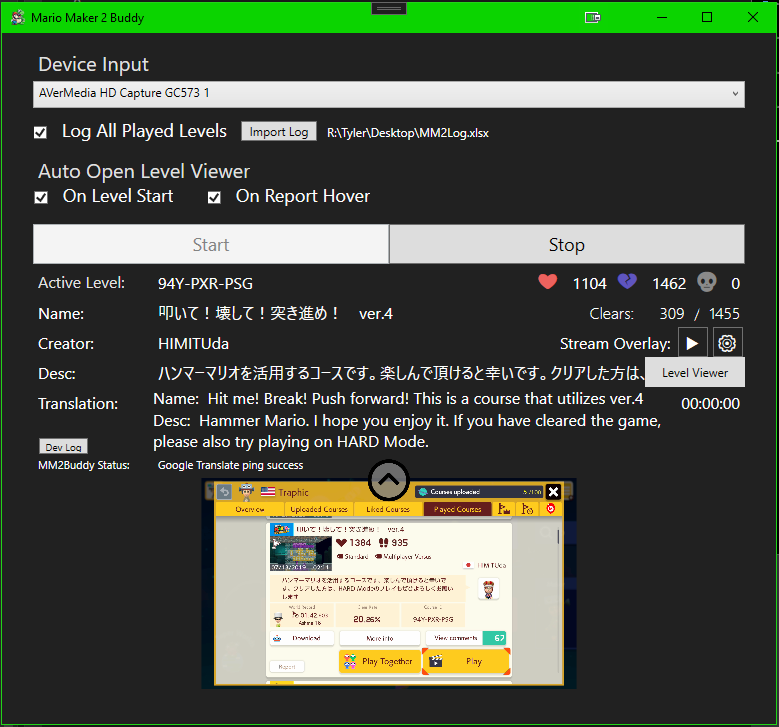
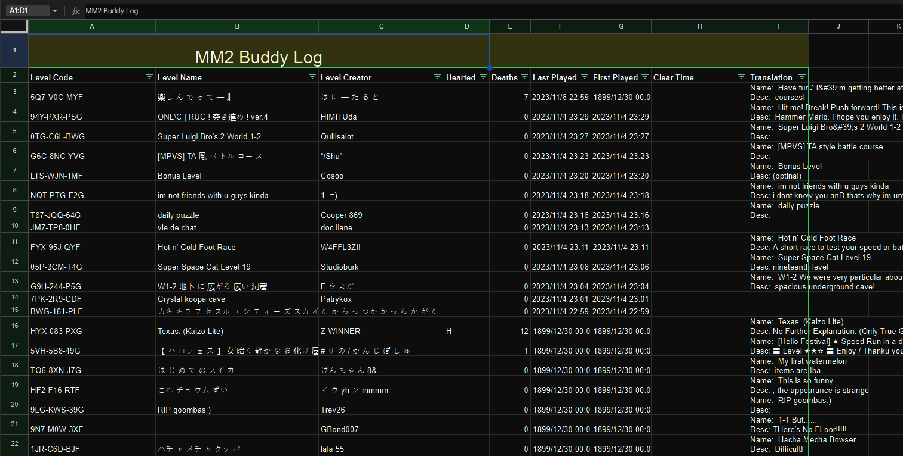
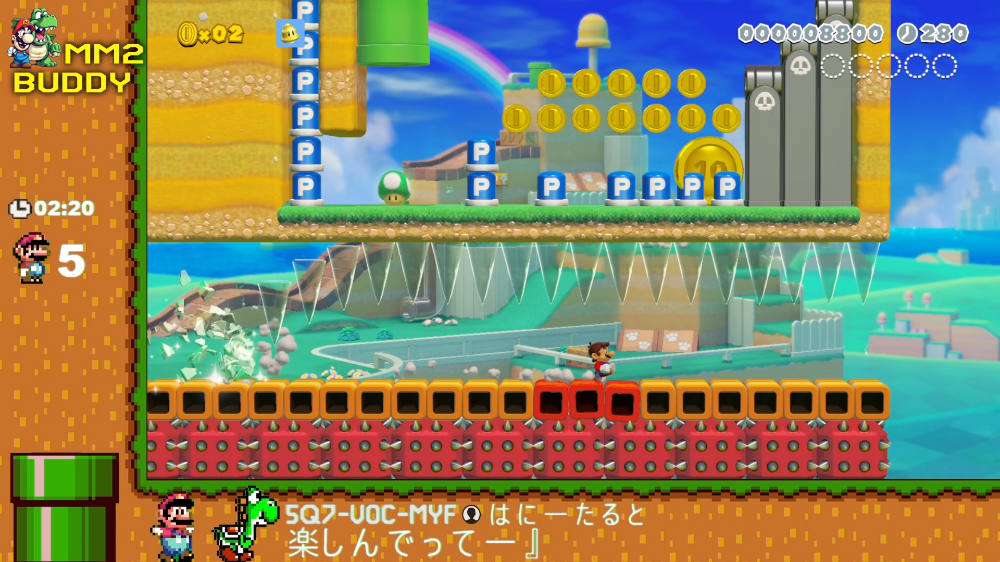
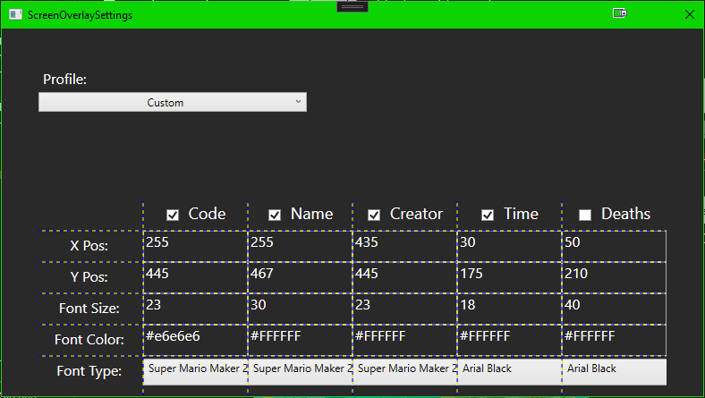
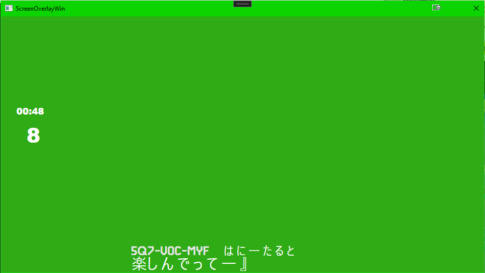

# MM2-Buddy
The ultimate assistant tool for Mario Maker 2 Twitch streamers or anyone with a capture card.  This program uses OCR to capture and log all level information into an Excel file as well as display level information in a stream overlay and in the app itself.  
It also can grab normally hidden information such as Boos, Descriptions, and clear rate(Endless).  MM2 Buddy can also provide real time translation for level names and descriptions.

## Features
- Excel data logging.  Log system saves Level Code, Level Name, Creator, Your Heart/Boo Vote, Death Count, Played Date, Clear Time, and Translation.

- Customizable stream overlay.  Stream overlay can provide Level Code, Level Name, Creator, Timer and Death Count.

- Live translation using Google's Translate API.  As soon as a level starts MM2 Buddy will grab name and description and translate (to english/other languages coming soon)

- Easy access to Wizulus' Level Viewer.  MM2 Buddy has options to automatically open the level viewer in a browser as soon as the level starts.

 

## Install
- Download and run [MM2BuddyInstall.exe](https://github.com/Traphiccone/MM2-Buddy/releases) from releases.
	- Follow the installation steps.  You may have to bypass Windows Defender to allow the install to proceed.
- The first time you run MM2 Buddy you will be prompted to install [Microsoft's .NET Desktop Runtime](https://dotnet.microsoft.com/en-us/download/dotnet/thank-you/runtime-desktop-6.0.24-windows-x64-installer?cid=getdotnetcore).  Download and install.
- Boot up MM2 Buddy again and enjoy.  See the How To Use section below

## How To Use
- After opening MM2 Buddy, select the capture device for your set up.  (Some users may need to run OBS's VirtualCam)
- If data logging is desired, check 'Log All Played Levels'.  This will prompt you for a save location on your pc to save the 'MM2Log.xlsx' file. (Recommend your desktop or documents folder)
	- Optionally if you have an existing MM2 Buddy log you can import it using the Import Log button.
- This will log all played levels including skipped levels.  
- Check 'On Level Start' if you want Wizulus' Level Viewer to automatically open in a browser during the Level Start screen.
- Similarly when browsing levels in the Courses section or after looking up a level code, the 'On Report Hover' button will open the Level Viewer in a browser.
	- Note do not actually press the report button, simply just hover the red selector over the Report button
- Press 'Start' to start the OCR video processing.
- When a level is detected, relevant information will be displayed in the MM2 Buddy app.
- Non English level names will be sent to Google Translate and the translation will be displayed in the MM2 Buddy app

# Stream Overlay Setup
- First time setup click both the stream overlay 'Play' button and the stream 'Settings' button
- In the settings window, check the data objects to be displayed in the stream and fill in the respective positions, font size, font color, and font type.
	- Note the color is a hex value is any value between #000000 and #FFFFFF.  Use [Google's Hex Color Picker](https://g.co/kgs/XW78BU) for help selecting a color.
	- Note the font list is pulled from the user's pc and any installed fonts will appear in the drop down list.
- In OBS, under Sources, add a Window Capture source and select '[MM2Buddy.exe]: ScreenOverlayWin' as the window source
	- Select 'Window title must match' for the Window Match Priority option
	- Key out the window's green color by right clicking the new window source, and selecting 'Filters'.
	- Add a Chroma Key filter, the exact key color for the window is #2FAB16.  Tweak the other key settings until satisfied with the stream display.

Example of a stream overlay and respective settings.

Enjoy your new Mario Maker 2 Buddy
